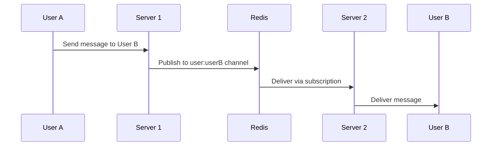
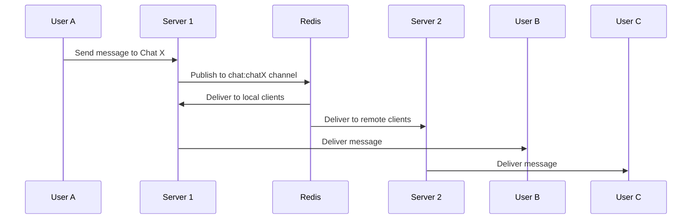
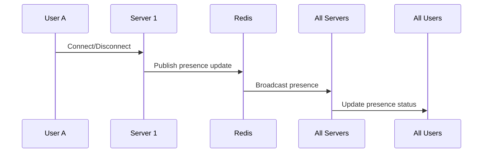

# WebSocket Pub/Sub Architecture

## Overview

This document describes the enhanced WebSocket architecture using Redis Pub/Sub for efficient single and group chat messaging across multiple server instances.

## Architecture Components

### 1. **PubSubManager** (`internal/services/pubsub_manager.go`)

Handles all Redis pub/sub operations for cross-instance communication.

#### Key Features:

- **Channel Management**: Manages subscriptions to user, chat, and system channels
- **Message Routing**: Routes messages based on channel type
- **Instance Coordination**: Enables communication between server instances
- **Presence Synchronization**: Keeps user presence consistent across instances

#### Channel Types:

```
user:<userID>        - Direct messages to specific users
chat:<chatID>        - Group chat messages
presence:global      - Global presence updates
system:global        - System-wide announcements
instance:<instanceID> - Instance-specific messages
```

### 2. **EnhancedHub** (`internal/services/websocket_hub_enhanced.go`)

WebSocket hub with integrated pub/sub support for scalable real-time messaging.

#### Key Features:

- **Multi-Instance Support**: Each instance has a unique ID
- **Automatic Channel Subscription**: Subscribes to relevant channels on client connection
- **Presence Management**: Syncs user presence with Redis
- **Connection Recovery**: Handles reconnections gracefully

## Message Flow

### Single User Chat (Direct Message)



### Group Chat



### Presence Updates



## Implementation Details

### Connecting a Client

```go
// When a client connects
client := &models.Client{
    ID:     uuid.New().String(),
    UserID: userID,
    // ...
}

// Register with enhanced hub
hub := GetEnhancedHubInstance()
hub.Register <- client

// This automatically:
// 1. Subscribes to user's personal channel
// 2. Subscribes to all user's chat channels
// 3. Updates presence to online
// 4. Publishes presence update to Redis
```

### Sending Messages

```go
// Send to a group chat
hub.SendChatMessage(ctx, chatID, &models.ChatMessage{
    ID:       messageID,
    ChatID:   chatID,
    SenderID: senderID,
    Content:  "Hello, group!",
    // ...
})

// Send direct message
hub.SendDirectMessage(ctx, targetUserID, &models.ChatMessage{
    ID:       messageID,
    SenderID: senderID,
    Content:  "Hello, friend!",
    // ...
})
```

### Handling Typing Indicators

```go
// Broadcast typing status
hub.BroadcastTypingIndicator(chatID, userID, true) // Start typing
hub.BroadcastTypingIndicator(chatID, userID, false) // Stop typing
```

## Scalability Benefits

### 1. **Horizontal Scaling**

- Add more server instances without code changes
- Load balance WebSocket connections across instances
- Messages automatically routed to correct instances

### 2. **Efficient Resource Usage**

- Only subscribe to relevant channels
- Minimize message duplication
- Local delivery for same-instance clients

### 3. **Fault Tolerance**

- If one instance fails, others continue operating
- Clients can reconnect to any available instance
- Presence updates ensure accurate online status

### 4. **Performance Optimizations**

- Batch presence updates every 30 seconds
- Cache user display info with TTL
- Clean up inactive connections automatically

## Redis Channel Patterns

### User Channels

- **Purpose**: Direct messages, notifications
- **Pattern**: `user:<userID>`
- **Subscribers**: All instances where user has active connections

### Chat Channels

- **Purpose**: Group chat messages
- **Pattern**: `chat:<chatID>`
- **Subscribers**: All instances with clients in that chat

### Global Channels

- **Purpose**: System-wide events
- **Patterns**:
  - `presence:global` - User online/offline status
  - `system:global` - Maintenance, announcements

## Configuration

### Redis Connection

```go
rdb := redis.NewClient(&redis.Options{
    Addr:     "localhost:6379",
    Password: "", // Set if required
    DB:       0,
})
```

### Hub Initialization

```go
func main() {
    // Get enhanced hub instance
    hub := GetEnhancedHubInstance()

    // Start hub with pub/sub
    if err := hub.Start(); err != nil {
        log.Fatal(err)
    }

    // Graceful shutdown
    defer hub.Stop()
}
```

## Best Practices

### 1. **Channel Naming**

- Use consistent prefixes (user:, chat:, etc.)
- Include relevant IDs in channel names
- Keep channel names short for performance

### 2. **Message Size**

- Keep messages under 1MB
- Use pagination for message history
- Compress large payloads if needed

### 3. **Subscription Management**

- Subscribe only to necessary channels
- Unsubscribe when no longer needed
- Monitor subscription count

### 4. **Error Handling**

- Implement retry logic for failed publishes
- Log subscription/unsubscription errors
- Monitor Redis connection health

### 5. **Security**

- Validate channel access permissions
- Sanitize message content
- Implement rate limiting

## Monitoring

### Key Metrics

- Active connections per instance
- Messages per second (pub/sub)
- Channel subscription count
- Redis memory usage
- Message delivery latency

### Health Checks

```go
// Get hub statistics
stats := hub.GetStats()
// Returns:
// {
//   "instanceId": "instance-abc123",
//   "totalClients": 150,
//   "totalChats": 25,
//   "subscribedChannels": 175,
//   ...
// }
```

## Troubleshooting

### Common Issues

1. **Messages not delivered**

   - Check Redis connectivity
   - Verify channel subscriptions
   - Check client connection status

2. **High memory usage**

   - Monitor subscription count
   - Check for subscription leaks
   - Review message size and frequency

3. **Presence not updating**
   - Verify Redis pub/sub working
   - Check presence sync interval
   - Review cleanup routines

## Future Enhancements

1. **Message Persistence**

   - Store messages in MongoDB before publishing
   - Implement message history API
   - Add offline message delivery

2. **Advanced Features**

   - Message encryption
   - File transfer support
   - Voice/video signaling

3. **Performance Improvements**
   - Connection pooling
   - Message batching
   - Compression algorithms

## Conclusion

This pub/sub architecture provides a robust, scalable solution for real-time messaging that can handle both single-user and group chats efficiently across multiple server instances. The use of Redis pub/sub ensures low latency and high throughput while maintaining simplicity in the codebase.
